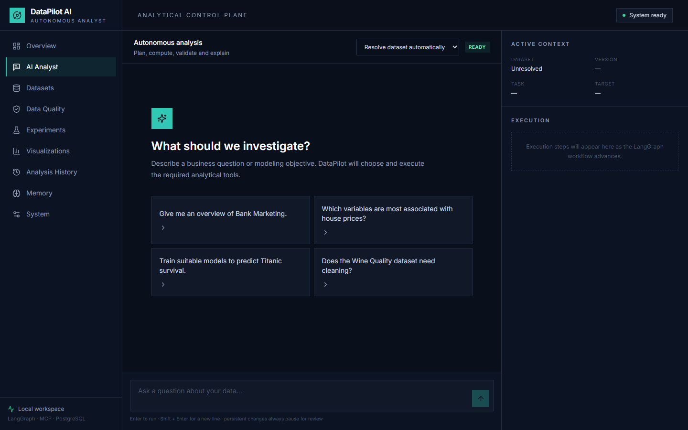
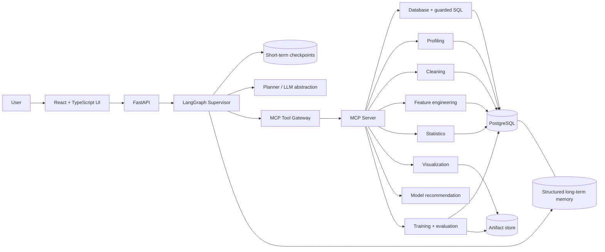
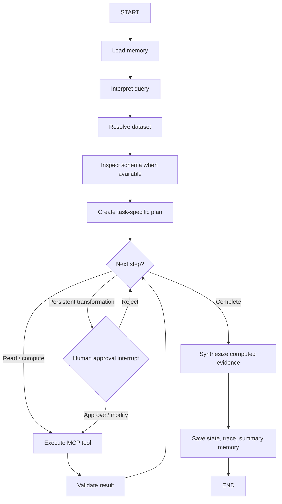

# DataPilot AI — Autonomous Data Analyst & Machine Learning Agent

**Live demo:** [Open DataPilot AI](https://datapilot-ai-demo.onrender.com/analyst) · **Source:** [GitHub repository](https://github.com/sneha2003/datapilot-ai)

DataPilot AI is a production-style internal analytics product that turns a high-level business or modeling objective into a traced, multi-step analytical workflow. A LangGraph supervisor plans and coordinates work; deterministic Python tools perform every calculation; MCP provides the tool boundary; PostgreSQL stores datasets, lineage, runs, experiments, artifacts, and memory.

The model never invents statistics, executes generated Python, or pretends to train a model. It chooses tools and explains their returned evidence.

## Product interface



## What it demonstrates

- Natural-language dataset discovery, schema inspection, and guarded SQL analysis
- Full profiles: missingness, duplicates, distributions, skew, cardinality, outliers, ID-like fields, constants, and leakage signals
- Cleaning and feature-engineering recommendation → preview → human approval → immutable version
- Classification and regression identification with user objective overrides
- Real scikit-learn `Pipeline` and `ColumnTransformer` training, leakage-safe preprocessing, five-fold cross-validation, holdout metrics, model comparison, and permutation importance
- Statistical tests and interactive Plotly artifacts
- LangGraph checkpoints for conversation state and PostgreSQL-backed structured long-term memory
- Every graph node, tool argument, result summary, duration, retry, error, and experiment is persisted
- Deterministic mock provider for tests and configurable Groq support for open-ended planning and explanation

## Architecture



## LangGraph workflow



The graph uses one supervisor with specialized nodes and tools. It does not create a room full of agents talking to one another.

## MCP tool catalog

The local stdio MCP server lives at `backend/app/mcp/server.py` and exposes dataset discovery, schema, samples, guarded SQL, profiling, missingness, correlations, cleaning recommendation/preview/application, feature recommendation/preview/application, task identification, and model recommendation. The LangGraph runtime uses the same MCP-compatible contracts through an in-process gateway, which keeps local execution fast while preserving a deployable protocol boundary.

Run the standalone server:

```bash
cd backend
python -m app.mcp.server
```

## Safety model

- SQL accepts one parsed `SELECT`/`UNION` statement only. Mutations, DDL, multiple statements, dangerous PostgreSQL functions, unknown tables, and unbounded responses are rejected.
- PostgreSQL statement timeouts and response row limits come from environment settings.
- The LLM receives no database credentials and cannot execute shell commands or generated Python.
- Charts use validated structured specifications.
- Cleaning and feature engineering accept only allow-listed operations.
- Original tables are never overwritten. Every applied transformation creates a child version with parent ID, operation list, and timestamp.
- LangGraph interrupts require approval before persistent transformations.
- Artifact paths are generated under the configured artifact root.

## Datasets

Raw files are intentionally not committed. `scripts/download_datasets.py` uses scikit-learn/OpenML APIs and records sources in `data/metadata/datasets.json`.

| Dataset | Source | License / terms | Typical work |
|---|---|---|---|
| Titanic | OpenML 40945 | OpenML/original public dataset terms | missingness, EDA, binary classification |
| Bank Marketing | UCI / OpenML 1461 | CC BY 4.0 | segmentation, imbalance, classification |
| California Housing | scikit-learn / StatLib | StatLib archive terms | regression, correlations, importance |
| Bike Sharing | UCI / OpenML 42712 | CC BY 4.0 | seasonality, business analysis, regression |
| Wine Quality | UCI / OpenML 287 | CC BY 4.0 | regression or classification by objective |

Review upstream terms before redistributing raw data. Citations are stored beside the registry metadata.

## Quick start

Requirements: Docker Desktop, Python 3.11+, Node 20+, and GNU Make (optional on Windows).

```bash
cp .env.example .env
docker compose up -d postgres
python -m pip install -r backend/requirements.txt
python scripts/download_datasets.py
python scripts/load_datasets.py
cd backend && uvicorn app.main:app --reload
```

In another terminal:

```bash
cd frontend
npm install
npm run dev
```

Open `http://localhost:5173`. The API docs are at `http://localhost:8000/docs`.

The default `.env.example` uses `LLM_PROVIDER=mock`, so the application runs without an API key. The mock provider is a deterministic intent planner, not a fake analytics engine: all returned analysis still comes from real tools.

For Groq:

```dotenv
LLM_PROVIDER=groq
LLM_MODEL=<a currently supported Groq model>
GROQ_API_KEY=<your key>
```

No model name is hard-coded. Set one supported by your Groq account.

### No cloud API key: run a local language model

The app can use a locally running Ollama model to interpret less predictable wording. Install [Ollama for Windows](https://ollama.com/download/windows), download a suitable text model using its documented `ollama pull <model>` command, and verify it appears in `ollama list`. Then set the following in `.env` and restart the backend:

```dotenv
LLM_PROVIDER=ollama
LLM_MODEL=<the installed model name shown by ollama list>
OLLAMA_URL=http://127.0.0.1:11434
```

Run the backend directly on Windows for this local-only URL; containers cannot reach the host's loopback address. A capable local model needs enough RAM and disk space. The model only selects tools; results still come from database queries and deterministic Python. The server validates selected tools and fields and always pauses before persistent transformations. If Ollama is not installed or a model is not downloaded, keep `LLM_PROVIDER=mock` until that setup is complete. The mock planner now also recognizes explicit questions using actual uploaded CSV column names, such as “average sale price by product type.”

### Moving local recovery data into PostgreSQL

If Docker is missing, install it using the [official Windows instructions](https://docs.docker.com/desktop/setup/install/windows-install/) and start Docker Desktop. Verify `docker version` works in a new PowerShell window. From the project directory, run `docker compose up -d postgres`, then `python scripts/migrate_recovery.py`. If PostgreSQL already contains the same public datasets under different registry IDs, use `python scripts/migrate_recovery.py --merge-equivalent`: it compares complete table contents before copying history and remaps dataset references. Back up both databases before an important migration. Existing chart/model file paths remain local and should be checked when moving the backend to another machine or container.

Restart the backend without a SQLite `DATABASE_URL` override after migration, and check `/api/system/health`: `storage` should report PostgreSQL. The local recovery database remains on disk as a fallback; it is not deleted.

## Docker

`docker compose up --build` runs PostgreSQL, FastAPI, and the production-built frontend. Download and load datasets before bringing up the complete stack, or run the scripts against the exposed PostgreSQL service.

The PostgreSQL volume is persistent. Backend and frontend can also run directly for faster development.

## Online demo deployment

The repository includes a single-service Docker image and a `render.yaml` Blueprint. The image builds React and FastAPI together, downloads the five documented public datasets during the image build, and seeds only missing PostgreSQL tables on startup. It does **not** publish local analysis history, uploaded data, model files, database backups, or `.env`.

1. Push this repository to GitHub.
2. In Render, choose **New → Blueprint** and select this repository. Review the service and database plans before creating them.
3. Wait for the web service to deploy, then open its `onrender.com` URL. Check `/api/system/health` for `storage: PostgreSQL` and open **Data sources** to verify all five public datasets.
4. The Blueprint starts with `LLM_PROVIDER=mock`. For flexible natural-language planning, add `GROQ_API_KEY` and a currently supported `LLM_MODEL` as secret environment variables, then set `LLM_PROVIDER=groq` and redeploy. Do not put the key in GitHub.

The Blueprint uses Render's free plans for an initial portfolio preview. A free web service may sleep when idle, and **a free Render PostgreSQL database expires after 30 days**. For a lasting resume link, upgrade the database or connect a persistent PostgreSQL provider before it expires. The cloud app stores new chart figures in PostgreSQL so charts survive web-service restarts; model training metrics persist, while local model files and in-progress approval checkpoints do not. This public demo has no user accounts, so do not upload confidential data.

## Common commands

```bash
make infrastructure  # PostgreSQL
make datasets        # public dataset downloads
make seed            # registry and analytical tables
make backend         # FastAPI dev server
make frontend        # Vite dev server
make test            # backend tests + frontend production build
make evaluate        # deterministic tool-selection suite
```

## End-to-end behavior

For “I want to predict whether a bank customer will subscribe to a term deposit,” the supervisor resolves Bank Marketing, loads its schema, profiles the actual table, identifies the target and task, recommends a bounded candidate set, builds leakage-safe preprocessing pipelines, trains and cross-validates each candidate, compares holdout and CV metrics, calculates permutation importance, writes model artifacts, saves experiments, and summarizes the measured trade-offs.

For “Clean Titanic,” it profiles the source, creates allow-listed operations, computes a preview, and interrupts. Approval creates `titanic_clean_v1`; rejection leaves the raw table untouched; modified operations are validated by the same engine.

Follow-ups inherit active dataset, target, latest experiments, and generated artifacts from session state. Later sessions can retrieve structured analysis summaries and preferences from PostgreSQL.

## API

Core routes:

- `POST /api/analyst/query`
- `POST /api/analyst/continue`
- `GET /api/analyst/sessions` and `/api/analyst/sessions/{id}`
- `GET /api/datasets`, `/api/datasets/{id}`, `/profile`, `/versions`
- `GET /api/experiments` and `/api/experiments/{id}`
- `GET /api/visualizations`
- `GET /api/memory`, `DELETE /api/memory/{id}`, `DELETE /api/memory`
- `GET /api/system/health` and `/api/system/metrics`

## Database design

`datasets` is both registry and lineage catalog. `analysis_sessions` stores current context; `analysis_runs` stores questions, plans, traces, findings, and status; `tool_executions` is the audit log; `model_experiments` stores metrics, parameters, CV results, duration and artifact paths; `generated_artifacts` stores plot specifications and files; `memory_entries` stores typed, keyed project memory.

Current session state always takes precedence over long-term preferences. Only structured preferences and summaries are persisted; raw conversation transcripts are not treated as memory.

## Evaluation and tests

The deterministic suite checks expected tool selection and approval compliance without claiming invented scores. Runtime system metrics remain `null` until real runs exist. The test suite covers:

- SQL parsing, mutation rejection, dangerous functions, unknown tables, execution, and row limits
- registry resolution and schemas
- profiles, cleaning previews, immutable cleaning versions, feature engineering, correlations, and memory lifecycle
- problem identification, model recommendation, classification/regression pipelines, CV, comparisons, and artifact persistence
- Plotly artifact creation
- planner routing and MCP gateway invocation

Run:

```bash
cd backend
pytest -q
python -m app.services.evaluation
```

## Repository layout

```text
backend/app/
  agents/        LangGraph state, planner, supervisor, validator, graph
  api/           reserved for route modules as the API grows
  database/      SQLAlchemy engine and persistent models
  mcp/           FastMCP server and MCP-compatible tool gateway
  memory/        structured persistence and retrieval
  services/      LLM abstraction and deterministic evaluation
  tools/         SQL, profiling, cleaning, features, statistics, plots, ML
frontend/src/    professional React analytics interface
scripts/         public-data download, loading, and seeding
data/metadata/   source, license, citation, task and target registry
artifacts/       trained pipelines, Plotly JSON, reports
evaluation/      tool-selection cases
```

## Asking business questions

Choose a dataset in the analyst workspace, then ask for an outcome rather than a technical calculation. Examples include “What patterns matter in this housing data?”, “Which categories perform best and worst?”, “Revenue fell last month; what changed?”, “Are discounts helping profit?”, and “What should we investigate next?” The analyst routes these to deterministic business tools. Depending on available columns, the tools calculate KPIs, monthly trends, segment rankings, change contributions, customer value, outliers, baseline forecasts, and numeric associations. Supporting charts are saved in Charts. The response leads with a finding, measured evidence, an action to consider, and limitations. If required fields are absent, it says which data is needed instead of inventing an answer.

The mock provider used for local testing recognizes a documented range of business questions; it is not a fine-tuned language model. Configure Groq for more flexible interpretation of unfamiliar wording. Groq still only plans and explains: Python tools perform the calculations. The tool-selection evaluation includes housing-pattern and sales-investigation questions, and backend integration tests assert that the reported figures come from dataset calculations.

## Limitations

- The deterministic mock planner covers common workflows and explicit uploaded-column questions; Groq or a local Ollama model provides flexible planning for broader phrasing. No model can infer business facts from fields the dataset does not contain.
- Local artifact files are not an enterprise model registry and are trusted only on the local machine.
- Statistical tools report tests and effect sizes but do not establish causation.
- Very large tables need sampling, warehouse pushdown, and queued training jobs beyond this local-first scope.
- Short-term LangGraph checkpoints are process-local; the structured session state and summaries remain in PostgreSQL across restarts, while an interrupted approval should be resumed before restarting the backend.

## Future work

Add time-series cross-validation as a first-class planner decision, PostgreSQL vector retrieval for semantic memories, background job execution for large experiments, model cards, row-level access policies, and richer counterfactual explanations.

## Resume bullets

- Built an autonomous AI data analyst using LangGraph and MCP that plans and executes multi-step analytical workflows across PostgreSQL datasets, including natural-language SQL, profiling, preprocessing, feature engineering, visualization and ML experimentation, with persistent memory, human-in-the-loop controls and tool-level evaluation.
- Implemented deterministic data and ML tools exposed through MCP for classification and regression workflows, model comparison and interactive Plotly visualizations, with LangGraph state management, error recovery and persistent experiment history.
